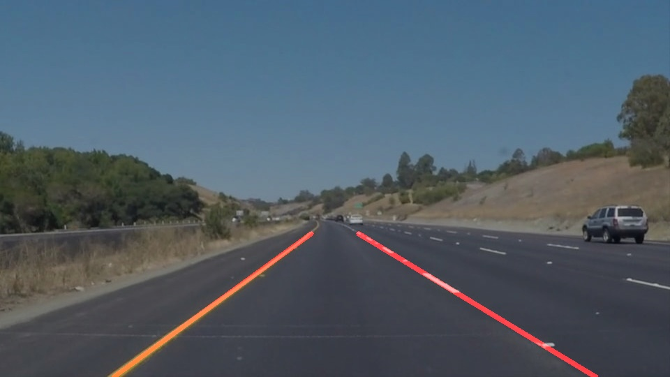

# Finding Lane Lines on the Road

Welcome to my implementation of the Term 1 project [Finding Lane Lines on the Road](https://github.com/udacity/CarND-LaneLines-P1) of the [Self-Driving Car NanoDegree](https://www.udacity.com/course/self-driving-car-engineer-nanodegree--nd013).

## Resources

* [Self-Driving Car NanoDegree](https://www.udacity.com/course/self-driving-car-engineer-nanodegree--nd013) course description at Udacity.
* [Finding Lane Lines on the Road](https://github.com/udacity/CarND-LaneLines-P1) project template on Github.

## Overview

In this project I am using Python and [OpenCV](https://opencv.org/) to detect and mark lane lines on highway [images](test_images) and [videos](test_videos). 

The image processing pipeline implemented in the project [Jupyter notebook](P1.ipynb) contains the following steps:
1. Mask color regions not compatible with bright grey/white and yellow areas.
2. Select a trapezoidal area in the lower half of the image where the lane lines are most likely to be expected.
3. Apply a Gaussian blur to reduce noise.
4. Apply a Canny Edge detection to mark areas with strong gradient, preferably the outlines of the lane lines.
5. Use a Hough Transformation to identify line segments.
6. Filter the detected line segments by their slope and position within the left/right half of the images.
7. Average the left/right half line segments and extrapolating them to the trapezoidal area.
8. Overlay the original image with the detected lane line.

## Structure

* [P1.ipynb](P1.ipynb): The Jupiter notebook containing the executable code with detailled comments
* [.ipynb_checkpoints/*](.ipynb_checkpoints): Jupyter checkpoints for [P1.ipynb](P1.ipynb)
* [test_images](test_images): Input folder for example images
* [test_images_output](test_images_output): Output folder for images processed with the current [P1.ipynb](P1.ipynb)
* [test_videos](test_videos): Input folder for example videos
* [test_videos_output](test_videos_output): Output folder for videos processed with the current [P1.ipynb](P1.ipynb)
* [writeup.md](writeup.md): The final writeup for this project

## Instructions

Follow the instructions at [CarND-Term1-Starter-Kit](https://github.com/udacity/CarND-Term1-Starter-Kit/blob/master/README.md) to setup the environment required to execute [P1.ipynb](P1.ipynb) and process your own media.

## License
The contents of this repository are covered under the [MIT License](https://github.com/mkleesiek/CarND-LaneLines-P1/blob/master/LICENSE).

