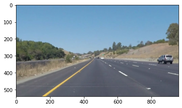
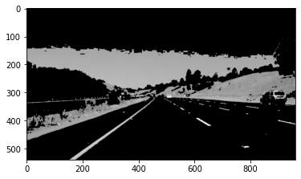
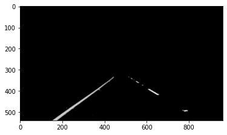
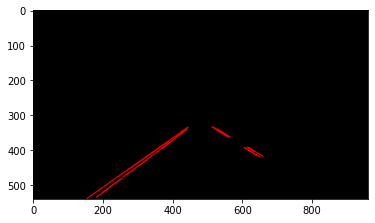
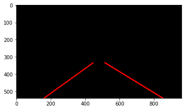
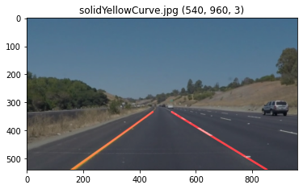

# **Finding Lane Lines on the Road - Writeup** 

## The Pipeline

When implementing the image processing pipeline, i stayed close to the structure suggested in the project template.
The pipeline itself consists of roughly 5 steps, after reading an image or video frame from the provided input material.

### 1. Select color regions of the image relevant to the line detection
After investigating the color of lanes from various video frames with a color picker, I chose a color region between (130, 130, 40) and (255, 255, 255). This selection will mask most of the areas darker than typical lane lines but still allow darker yellow lines to be included.
The maske image is converted to greyscale at the end of this step.

### 2. Select a trapezoidal area in the lower half of the image where the lane lines are most likely to be expected
Despite this area being hard-coded (in relative units of image height and widths), it works very well for all images and videos provided in this project.

### 3. Apply a Gaussian blur
I chose a kernel size of 5 which seems to reduce a reasonable amount of noise in the image without taking away any important detail later needed for the line detection

### 4. Apply Canny Edge detection to mark strong gradients
In this step, the thresholds 50:130 works well for me, preserving all of the interesting lane line edges.

### 5. Detect and extrapolate line segments

#### 5.1 Detect line segments using Hugh Transform
The edges from the previous step are transformed into a series of lines, using a Hugh Transformation.
A threshold of 30, minimum line length of 20 and maximum line gap of 5 turned out to work fine for the examples.

#### 5.2. Filter the detected line segments by their slope and position within the left/right half of the image
While in the simpler test images most of the detected lines were actually useful, some of the videos produced larger amounts of "false" line segments, coming from remaining noise enhanced by the Canny Edge algorithm or extended bright areas in the image.

I tacled the problem by first filtering those lines which had a non plausible slope (either to flat or vertical) or where the slope (positive/negative) did not match the expected line position in the picture (left/right half).
With the remaining lines' slope and position matching my expectations of how the left and right lane line would be oriented, I partitioned those lines into two separate lists, one for the left, the other for the right lane line.

#### 5.3. Average the left/right half line segments and extrapolating them to the trapezoidal area

Within both of these list, I averaged the slopes and positions of all remaining lines and extrapolated them to result in a single line extending from the bottom to the top of the trapezoidal area of interest.

The averaging is performed using weights, based on the length of the detected lines from the Hugh Transform: I considered longer lines to be more reliable results from that transformation and assigned them a stronger weight on the end result.

The last two steps turned out to be crucial in order to make the pipeline robust enough to handle the optional ["challenge" video](test_videos_output/03-challenge.mp4).

I added one more gimmick: The width of the extrapolated lines is calculated based on the standard deviation of the lines' x-position at the lower edge of the image. The width of these lines now gives a rough measure of confidence on the extrapolation result: The thicker the line, the more uncertain the averaged line position (and indirectly slope).

### 6. Overlay the original image with the detected lane line

## Shortcomings with my current pipeline

* The color selection is adjusted and tested with day-time images only and furthermore tuned to white and yellow lines.
  
* The selected area (trapezoid) is hard-coded. Obviously a more dynamic, self-adjusting method would better adapt to more extreme topographies, different camera optics, etc.

## Possible improvements

* The pipeline is effectively fitting straight lines to potentially curved lanes. A more flexible modelling, e.g. fitting the detected Canny edges or Hugh line segments to a model of a lane line (some polynomial or even taking into account the thickness) could improve the result - but on the other hand might increase complexity and affect robustness of this algorithm.
  
* The lane line detection on videos works on individual images, completely ignoring the information provided by a time series of images: Averaging the lane lines over multiple frames could considerably improve the jitter, which can be observed in most of the videos.
